# HoloNet

**SNMP trap → messaging bridge.** HoloNet is a small NMS that receives SNMP
traps from network devices (initial target: **Sophos SFVH / SFOS**), classifies
each event into a priority level via a user-editable rule engine, applies flood
control, and dispatches notifications to configurable channels — Telegram,
WhatsApp, generic webhooks, and anything
[Shoutrrr](https://github.com/containrrr/shoutrrr) supports.

Single Go binary, embedded React console, pure-Go SQLite, `FROM scratch` image.

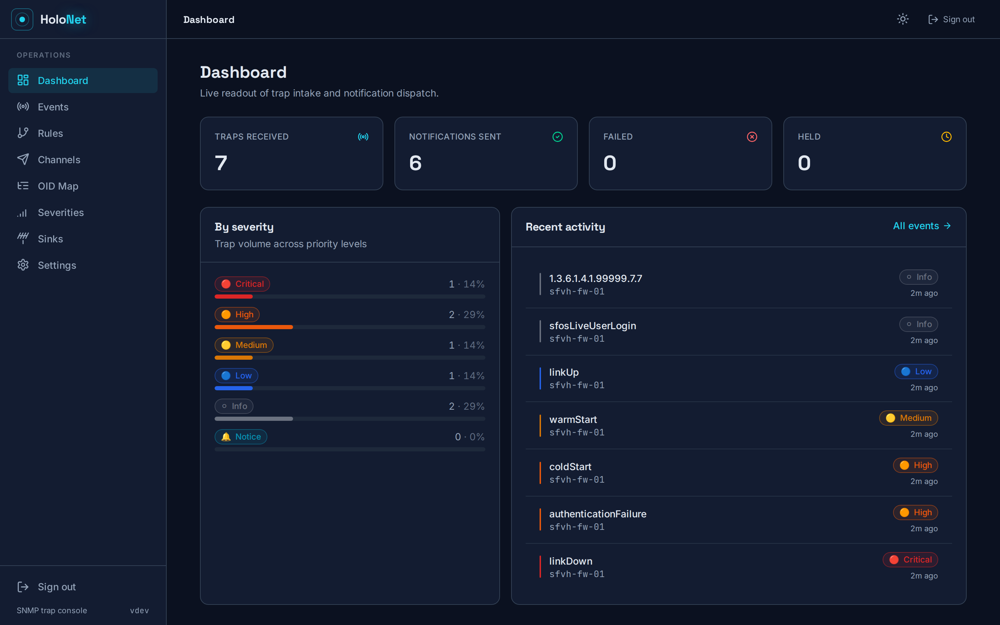

---

## Highlights

- **Trap sink** for **SNMPv2c and SNMPv3** (authNoPriv / authPriv) on one UDP
  socket. The v3 path is recover-guarded so a malformed packet can never crash
  the process; unknown communities and failed authentications are dropped and
  counted.
- **OID → event decoding** with a curated built-in table (RFC generic
  notifications seeded) plus manual edits and Sophos MIB import.
- **Rule engine** — ordered, first-match, glob/device/regex matching, severity
  assignment, per-severity default routes, and a per-rule
  `bypass_flood_control` so Critical always sends.
- **Flood control** — `none`, `dedupe`, `rate_limit` (with a "+K more" summary),
  and `digest` (grouped rollups), switchable at runtime.
- **Notifications** — Shoutrrr (Telegram, Discord, Slack, ntfy, …), a self-hosted
  WhatsApp gateway, and generic webhooks. Best-effort, concurrent, with retries.
- **Secrets sealed at rest** — every community string, v3 password, and channel
  credential is AES-256-GCM encrypted with a boot-time master key. Nothing
  sensitive is ever returned by the API or written in plaintext.
- **Modern console** — responsive React/Vite SPA embedded in the binary, with a
  sortable Events tab, drag-free rule reordering, live refresh, dark/light, and
  a first-run setup wizard. Auth can be disabled when fronted by Cloudflare
  Access.
- **Prometheus metrics** at `/metrics`, **OpenAPI** at `/api/docs`.

---

## Screenshots

### Events — sortable, severity-coded, per-rule routing
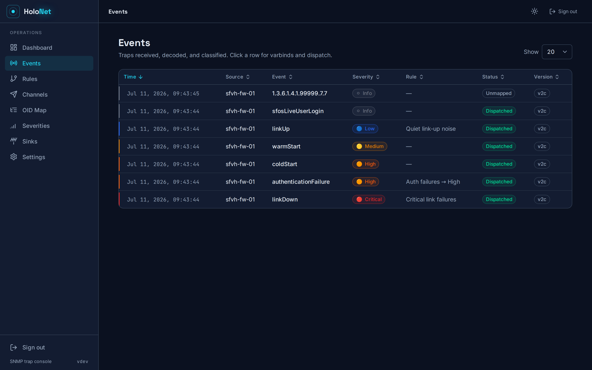

Click any row for the decoded varbinds, per-channel dispatch status, and a
**Replay routing** action that re-runs the rules against a stored trap.

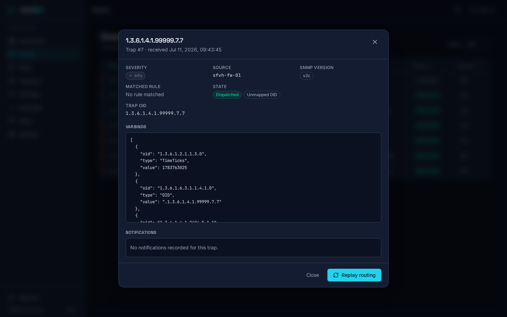

### Rules — ordered, first-match classification and routing
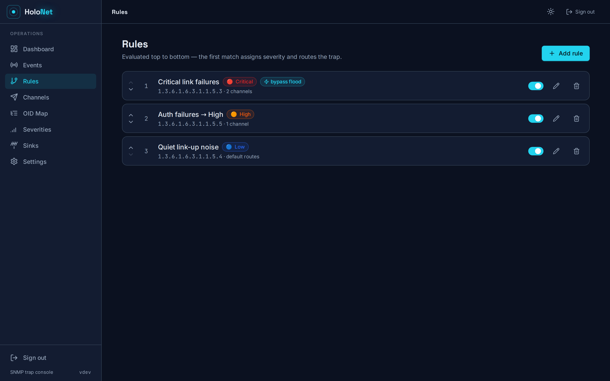

### Channels — Shoutrrr / WhatsApp / webhook, with a real Send test
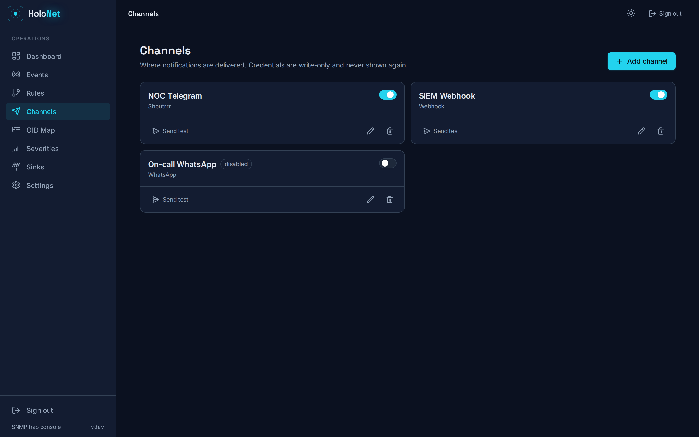

### OID Map, Severities, Sinks, Settings
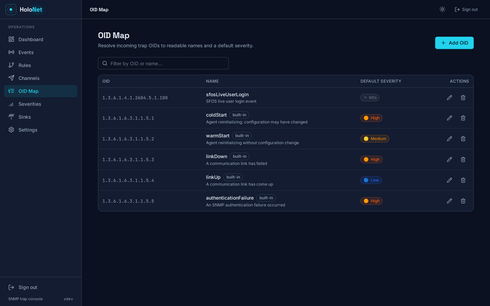
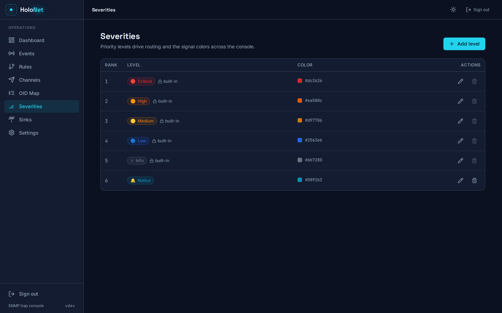
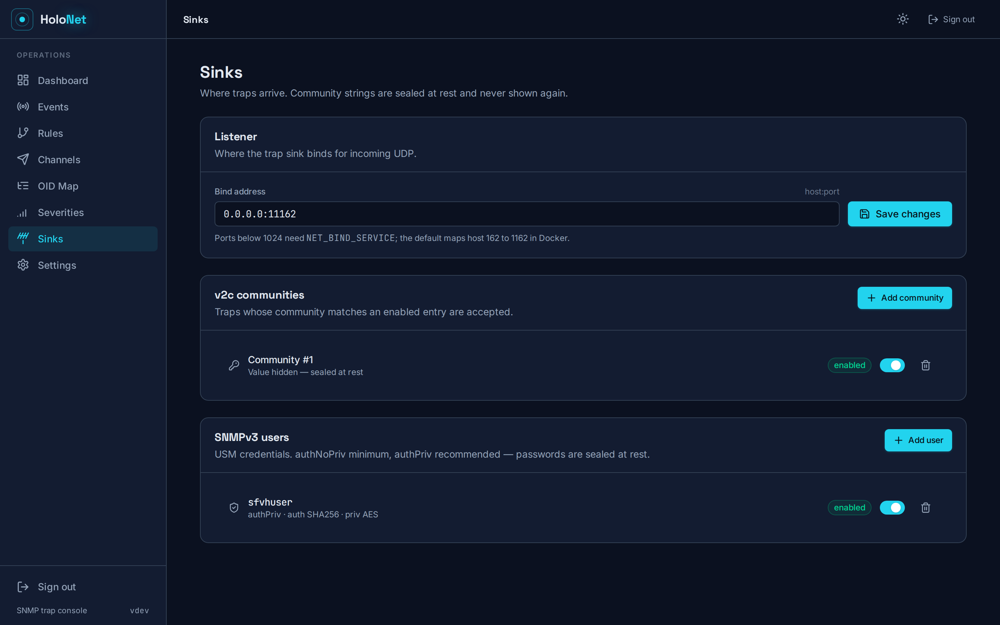
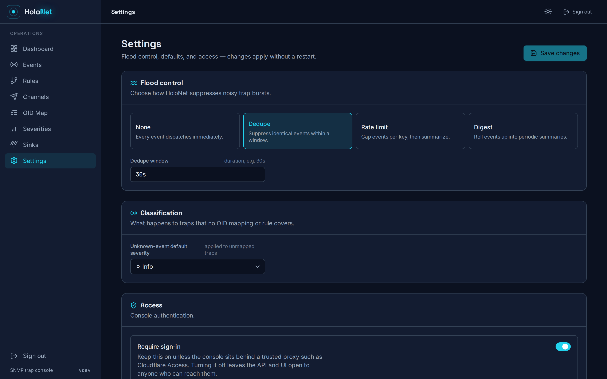

### Light theme and mobile
System-preference-aware, with a toggle in the header. The Events table collapses
to cards on narrow viewports (sorting stays available).

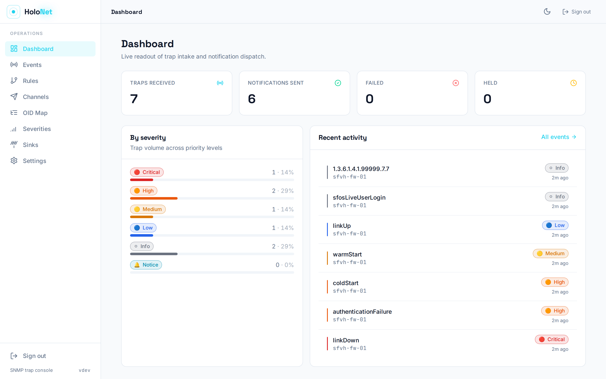
<p>
  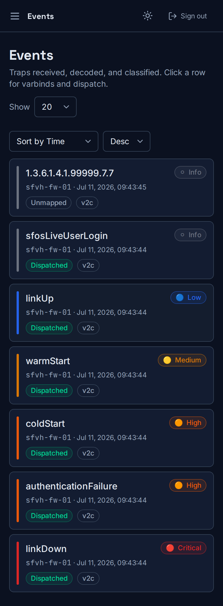
</p>

---

## Architecture

```
UDP :1162
   │
Trap Sink (v2c + v3) → Decoder (OID→event) → Rule Engine (severity + routes)
                                                     │
                                              Flood control
                                                     │
              ┌──────────────┬─────────────────┬─────┘
              ▼              ▼                 ▼
        Shoutrrr        WhatsApp           Webhook        → dispatch log
              └────────────── SQLite (traps, notifications, config) ──────────────┘
                                     │
                            chi API ◀▶ embedded React SPA   ·   /metrics (Prometheus)
```

Pipeline: **Sink → Decode → Classify → Flood control → Dispatch → Persist → Surface.**

---

## Quick start (Docker)

```yaml
# docker-compose.yml
services:
  holonet:
    image: techblog/holonet:latest
    ports:
      - "162:1162/udp"   # host 162 → container 1162 (unprivileged inside)
      - "8080:8080"      # web UI + REST API
    environment:
      HOLONET_MASTER_KEY: ${HOLONET_MASTER_KEY}   # openssl rand -base64 32
    volumes:
      - holonet-data:/data
    restart: unless-stopped
volumes:
  holonet-data:
```

```sh
export HOLONET_MASTER_KEY="$(openssl rand -base64 32)"
docker compose up -d
# open http://localhost:8080 and complete the first-run setup wizard
```

The master key seals every secret at rest — **keep it stable**; losing it makes
sealed community strings and channel credentials unreadable.

## Build from source

```sh
# backend + tests
go build ./... && go test ./...
# frontend (embedded into the binary)
cd web && npm ci && npm run build && cd ..
# single binary with the UI embedded
go build -o holonet ./cmd/holonet
```

`CGO_ENABLED=0` throughout (pure-Go SQLite), so binaries cross-compile cleanly.
`scripts/build.sh` produces the full release matrix into `dist/`.

---

## Configuration

Only **bootstrap** values come from flags/env; everything operational
(communities, v3 users, devices, severities, OID map, channels, rules, routes,
flood strategy, bind address) lives in SQLite and is managed from the UI/API.

| Flag | Env | Default | Purpose |
|------|-----|---------|---------|
| `--db-path` | `HOLONET_DB_PATH` | `/data/holonet.db` | SQLite database file |
| `--master-key` | `HOLONET_MASTER_KEY` | *(required)* | AES-GCM key sealing secrets at rest |
| `--http-addr` | `HOLONET_HTTP_ADDR` | `:8080` | Web/API listen address |
| `--secure-cookies` | `HOLONET_SECURE_COOKIES` | `false` | Set the `Secure` flag on session cookies (enable behind TLS) |
| `--log-level` | `HOLONET_LOG_LEVEL` | `info` | `debug` / `info` / `warning` / `error` |
| `--version` | | | Print version and exit |

Precedence: `ENV` → `--flag` → built-in default. The SNMP **bind address** is
stored in SQLite (default `0.0.0.0:1162`) and edited from **Sinks**. Binding a
port below 1024 needs `CAP_NET_BIND_SERVICE` (`cap_add: ["NET_BIND_SERVICE"]`);
the default compose maps host `162` → container `1162`.

---

## Configuring the Sophos firewall

1. **SNMP agent** — *Administration → SNMP*: enable the agent, then add a **v2c
   community** and/or an **SNMPv3 user** (auth required — authNoPriv minimum,
   authPriv recommended; `noAuthNoPriv` is rejected by HoloNet).
2. **Zone access** — *Administration → Device access*: allow **SNMP** for the
   zone the firewall will send from.
3. **Trap destination** — *System services → Notification list* (or the SNMP
   trap settings): enable **SNMP traps** for the events you care about and point
   the trap destination at the HoloNet host and port.
4. In HoloNet, add the matching community (**Sinks → Add community**) or v3 user
   (**Sinks → Add user**), then watch the **Events** tab.

### Importing the SFOS MIB

Sophos enterprise OIDs are **not hardcoded** — import them from your firewall:

1. On the firewall, *SNMP* page → **Download MIB**.
2. Translate the MIB to name/OID pairs, e.g.:
   ```sh
   snmptranslate -Td -Ln -m ./SFOS-FIREWALL-MIB.txt -M +. -On <oid> ...
   # or dump the tree:
   snmptranslate -Tz -m ./SFOS-FIREWALL-MIB.txt
   ```
3. Add the entries under **OID Map** (name, description, default severity), or
   map unmapped OIDs directly from the Events tab as they arrive. The older
   Astaro/UTM lineage encoded severity into the OID structure; SFOS uses its own
   MIB layout, so map deliberately rather than assuming.

---

## API & metrics

- **REST API** under `/api/v1`; interactive docs and the OpenAPI 3 spec at
  **`/api/docs`** (`/api/openapi.yaml`). Every UI action maps to an endpoint.
  Authentication is a session cookie (`holonet_session`) issued by
  `/api/v1/auth/login`; first run uses `/api/v1/auth/setup`. When `auth.enabled`
  is `false`, the API is open (intended for Cloudflare Access front-ends).
- **Prometheus** at **`/metrics`** (`holonet_` namespace: traps received,
  suppressed, notifications, auth failures, decode panics, active channels, plus
  Go runtime). Scrape endpoints are unauthenticated by convention — restrict
  `/metrics` at the network layer.

---

## Security

- Secrets (community strings, v3 auth/priv passwords, channel credentials) are
  **AES-256-GCM sealed** with the master key; the API never returns them.
- v3 enforces password protection; `noAuthNoPriv` is refused.
- The web console is protected by a single bcrypt admin credential with a
  signed session cookie; the settings API only accepts a fixed allow-list of
  keys.

## License

Apache-2.0.
