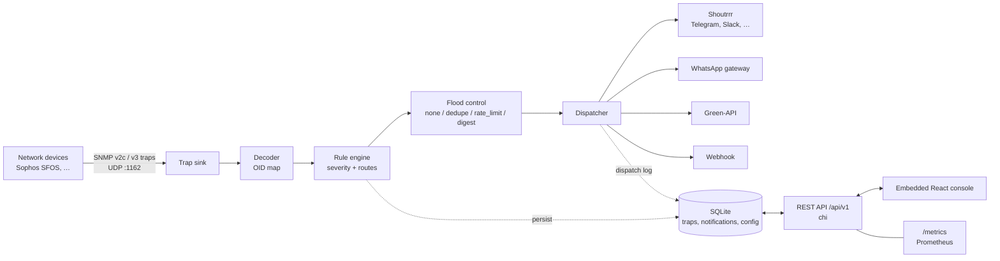

# HoloNet

[](https://github.com/t0mer/Holonet/actions/workflows/docker.yml)
[](https://hub.docker.com/r/techblog/holonet)
[](https://hub.docker.com/r/techblog/holonet)
[](go.mod)
[](LICENSE)

**SNMP trap → messaging bridge.** HoloNet is a small, self-hosted NMS that
receives SNMP traps from network devices (initial target: **Sophos SFVH / SFOS**),
classifies each event into a priority level with a user-editable rule engine,
applies flood control, and sends notifications to the channels you configure:
Telegram, WhatsApp (a self-hosted gateway or the [Green-API](https://green-api.com)
cloud), generic webhooks, and anything else
[Shoutrrr](https://github.com/containrrr/shoutrrr) supports.

It ships as a single Go binary with an embedded React console and pure-Go SQLite,
packaged as a `FROM scratch` Docker image.


---

## Table of contents

- [Features](#features)
- [Screenshots](#screenshots)
- [Architecture](#architecture)
- [Requirements](#requirements)
- [Installation](#installation)
  - [Docker Compose](#docker-compose)
  - [Docker](#docker)
  - [Build from source](#build-from-source)
  - [Running as a service](#running-as-a-service)
- [Configuration](#configuration)
  - [Bootstrap flags and environment variables](#bootstrap-flags-and-environment-variables)
  - [Runtime settings (stored in SQLite)](#runtime-settings-stored-in-sqlite)
- [Usage](#usage)
  - [First run](#first-run)
  - [Console walkthrough](#console-walkthrough)
  - [Rule engine](#rule-engine)
  - [Severity levels](#severity-levels)
  - [Flood control](#flood-control)
- [Notification channels](#notification-channels)
- [Configuring the Sophos firewall](#configuring-the-sophos-firewall)
- [API reference](#api-reference)
- [Prometheus metrics](#prometheus-metrics)
- [Security](#security)
- [Troubleshooting](#troubleshooting)
- [Development](#development)
- [Contributing](#contributing)
- [License](#license)

---

## Features

- **Trap sink** for **SNMPv2c and SNMPv3** (authNoPriv / authPriv) on a single
  UDP socket (default `0.0.0.0:1162`). The listener is recover-guarded, so a
  malformed packet cannot crash the process. Traps with an unknown community are
  dropped and counted. SNMPv1 traps are ignored.
  - SNMPv3 auth protocols: `MD5`, `SHA`, `SHA224`, `SHA256`, `SHA384`, `SHA512`.
  - SNMPv3 privacy protocols: `DES`, `AES`, `AES192`, `AES256`, `AES192C`, `AES256C`.
  - `noAuthNoPriv` users are rejected.
- **OID → event decoding** with an editable OID map. The RFC generic
  notifications (`coldStart`, `warmStart`, `linkDown`, `linkUp`,
  `authenticationFailure`) are seeded. Vendor OIDs such as the Sophos MIB are
  added by hand or mapped from the Events drawer. Unmapped traps get a
  configurable default severity and are flagged in the UI.
- **Rule engine**: ordered, first-match rules that match on device, OID glob,
  and a regex over the event message. Rules assign a severity and route to
  channels, with per-severity default routes as a fallback. Rules can also
  continue matching or bypass flood control.
- **Five built-in severity levels** (Critical, High, Medium, Low, Info), each
  with a color and emoji. You can add your own levels.
- **Flood control**: `none`, `dedupe`, `rate_limit` (with a "+K more" summary)
  and `digest` (grouped rollups). You can switch strategy at runtime without a
  restart.
- **Notifications** through Shoutrrr (Telegram, Discord, Slack, ntfy, email, …),
  WhatsApp via a self-hosted
  [go-whatsapp-web-multidevice](https://github.com/aldinokemal/go-whatsapp-web-multidevice)
  gateway **or the Green-API cloud**, and generic webhooks. Sending is
  concurrent and best-effort: each attempt has a 10 s timeout and failed sends
  get 2 retries. Each channel's result is recorded per trap as a notification row. Only
failures are written to the log.
- **Secrets sealed at rest**: community strings, SNMPv3 passwords and channel
  configs are AES-256-GCM encrypted with a key derived from the master key. The
  API never returns them.
- **Modern console**: a responsive React/Vite SPA embedded in the binary. It
  has a sortable Events tab, drag-to-reorder rules with an inline **Test**
  (dry-run), one-click OID mapping from the Events drawer, **Replay routing**,
  live refresh (~60 s), dark/light themes and a first-run setup wizard. You can
  turn auth off when HoloNet sits behind Cloudflare Access.
- **Prometheus metrics** at `/metrics`, an **OpenAPI 3 spec** at
  `/api/openapi.yaml`, and docs at `/api/docs`.
- **OS service support** (systemd, launchd, Windows services) through
  `--service install|start|stop|restart|uninstall`.

---

## Screenshots

### Events: sortable, severity-coded, per-rule routing


Click any row to see the decoded varbinds and the dispatch status for each
channel. The **Replay routing** action runs a stored trap through the pipeline
again.


### Rules: ordered, first-match classification and routing
Drag rules to reorder them. **Test** dry-runs a sample event, so you can see
which rule wins and where the event goes before you save.

Each rule can route to its **own set of channels**. Select any combination of
channels on the rule, and a matching event goes only to those. Leave a rule's
channels empty to fall back to the per-severity **default routes**. For example,
you can send Critical firewall events to an on-call WhatsApp number while
everything else goes to a Telegram ops room.


You can name unmapped OIDs on the spot from the Events drawer:


### Channels: Shoutrrr / WhatsApp / Green-API / webhook, with a real Send test


WhatsApp messages can go through the [Green-API](https://green-api.com) cloud.
Enter the Instance ID, the API token and the recipient phone number
(international format, digits only; a JID also works). Leave **API URL** blank
to use `https://api.green-api.com`. If the Green-API console shows a cluster
URL (e.g. `https://7103.api.greenapi.com`), enter that instead.


### OID Map, Severities, Sinks, Settings


### Light theme and mobile
The theme follows the system preference, and the header has a toggle. On narrow
screens the Events table turns into cards, and sorting still works.


<p>
  
</p>

<!-- TODO: screenshot — first-run setup wizard / sign-in screen -->

---

## Architecture


```mermaid
flowchart LR
    dev[Network devices<br/>Sophos SFOS, …] -- "SNMP v2c / v3 traps<br/>UDP :1162" --> sink[Trap sink]
    sink --> dec[Decoder<br/>OID map]
    dec --> rules[Rule engine<br/>severity + routes]
    rules --> flood[Flood control<br/>none / dedupe / rate_limit / digest]
    flood --> disp[Dispatcher]
    disp --> sh[Shoutrrr<br/>Telegram, Slack, …]
    disp --> wa[WhatsApp gateway]
    disp --> ga[Green-API]
    disp --> wh[Webhook]
    rules -. persist .-> db[(SQLite<br/>traps, notifications, config)]
    disp -. dispatch log .-> db
    db <--> api[REST API /api/v1<br/>chi]
    api <--> spa[Embedded React console]
    api --- metrics["/metrics<br/>Prometheus"]
```

Pipeline: **Sink → Decode → Classify → Flood control → Persist → Dispatch → Surface.**

Every trap is stored, including suppressed ones. Notification rows are written
as follows:

- **Sent immediately:** one row per channel, with status `sent` or `failed`.
- **Held for a `rate_limit` summary or a `digest`:** a single `held` row with no
  channel.
- **Suppressed by `dedupe`:** no notification row.

The rollup and digest messages sent later are not recorded as notification
rows.

---

## Requirements

- One of:
  - Docker (images for `linux/amd64`, `linux/arm64`, `linux/arm/v7`), or
  - Go **1.25** and Node.js **20** to build from source.
- A **master key**: any non-empty string, ideally high-entropy
  (`openssl rand -base64 32`). It is required to start the daemon.
- Network reachability from your devices to the trap port (UDP `1162` by
  default, or `162` when remapped).
- Credentials for the notification channels you plan to use (Telegram bot token,
  Green-API instance, WhatsApp gateway, webhook URL, …).

---

## Installation

### Docker Compose

The image is published on Docker Hub as
[`techblog/holonet`](https://hub.docker.com/r/techblog/holonet) (`latest` and
dated `YYYY.M.PATCH` tags). This is the repository's
[`docker-compose.yml`](docker-compose.yml), with its comments shortened:

```yaml
services:
  holonet:
    image: techblog/holonet:latest
    ports:
      - "162:1162/udp"   # host 162 → container 1162 (unprivileged inside)
      - "8080:8080"      # web UI + REST API
    environment:
      HOLONET_MASTER_KEY: ${HOLONET_MASTER_KEY}   # openssl rand -base64 32
      LOG_LEVEL: info                             # has no effect, see below
      # HOLONET_SECURE_COOKIES: "true"            # when served over TLS
    volumes:
      - holonet-data:/data   # SQLite DB + WAL; persist it
    # Optional: bind 162 directly inside the container instead of remapping.
    # cap_add: ["NET_BIND_SERVICE"]
    restart: unless-stopped
volumes:
  holonet-data:
```

`LOG_LEVEL` is not read by HoloNet, so that line has no effect. To change the
log level, use `command: ["--log-level", "debug"]` (see the
[configuration note](#bootstrap-flags-and-environment-variables)).

```sh
export HOLONET_MASTER_KEY="$(openssl rand -base64 32)"
docker compose up -d
# open http://localhost:8080 and complete the first-run setup wizard
```

The master key seals every secret at rest, so **keep it stable**. If you lose
it, the sealed community strings, SNMPv3 passwords and channel credentials can
no longer be read. It also signs session cookies, so changing it signs everyone
out.

The image runs as the non-root UID `10001` and stores its database at
`/data/holonet.db`. Use a named volume (as above) so that `/data` stays writable.

### Docker

```sh
docker run -d --name holonet \
  -p 162:1162/udp -p 8080:8080 \
  -e HOLONET_MASTER_KEY="$(openssl rand -base64 32)" \
  -v holonet-data:/data \
  --restart unless-stopped \
  techblog/holonet:latest
```

The entrypoint is the `holonet` binary, so extra flags go after the image name,
e.g. `techblog/holonet:latest --log-level debug`.

### Build from source

No prebuilt binaries are attached to GitHub Releases yet. Build them yourself:

```sh
git clone https://github.com/t0mer/Holonet.git && cd Holonet
# frontend (Vite writes straight into internal/webui/dist, which is embedded)
cd web && npm ci && npm run build && cd ..
# backend + tests
go test ./...
# single binary with the UI embedded
CGO_ENABLED=0 go build -o holonet ./cmd/holonet
./holonet --master-key "$(openssl rand -base64 32)" --db-path ./holonet.db
```

`CGO_ENABLED=0` works throughout because SQLite is pure Go, so the binaries
cross-compile cleanly. `scripts/build.sh` builds the frontend (unless
`SKIP_FRONTEND=1` is set) and cross-compiles the full matrix into `dist/`:
Linux `amd64`/`arm64`/`armv7`/`armv6`/`386`, macOS `amd64`/`arm64`, and Windows
`amd64`/`arm64`. Set `VERSION=…` to stamp the build.

If you skip the frontend build, the binary still compiles and serves the API,
but it embeds only a `.gitkeep` placeholder. `/` then shows a directory listing
instead of the console.

### Running as a service

`--service install` registers HoloNet with the OS service manager (systemd,
launchd, Windows services, …). The flags you pass alongside it are baked into
the unit:

```sh
sudo holonet --service install --db-path /var/lib/holonet/holonet.db \
  --http-addr :8080 --master-key "$HOLONET_MASTER_KEY"
sudo holonet --service start
```

The installed unit always gets `--db-path`, `--http-addr` and `--log-level`,
plus `--secure-cookies` and `--master-key` when they are set. If you pass the
master key as a flag, it ends up in the unit's `ExecStart`. The key is also baked in when it comes from the environment: if
`HOLONET_MASTER_KEY` is exported in the shell that runs `--service install`, it
is written into the unit as `--master-key`. To keep it out of the unit file,
install without `--master-key` **and** with `HOLONET_MASTER_KEY` unset (e.g.
`env -u HOLONET_MASTER_KEY holonet --service install …`). Then set
`HOLONET_MASTER_KEY` in the service environment instead (e.g. a systemd drop-in
or `/etc/sysconfig/holonet`). Other actions are `stop`, `restart` and `uninstall`.

---

## Configuration

Only **bootstrap** values come from flags or the environment. Everything
operational lives in SQLite and is managed from the UI/API: communities, SNMPv3
users, devices, severities, OID map, channels, rules, default routes, flood
strategy and the SNMP bind address.

### Bootstrap flags and environment variables

| Flag | Env | Default | Purpose |
|------|-----|---------|---------|
| `--master-key` | `HOLONET_MASTER_KEY` | *(required)* | Key for AES-256-GCM sealing of secrets. Also used to derive the session-cookie signing key |
| `--db-path` | `HOLONET_DB_PATH` ¹ | `/data/holonet.db` | SQLite database file (WAL mode) |
| `--http-addr` | `HOLONET_HTTP_ADDR` ¹ | `:8080` | Web UI / API listen address |
| `--log-level` | `HOLONET_LOG_LEVEL` ¹ | `info` | `debug` / `info` / `warning` / `error`. `debug` also logs gosnmp's internal decode/USM output |
| `--secure-cookies` | `HOLONET_SECURE_COOKIES` | `false` | Set the `Secure` flag on session cookies (enable behind TLS) |
| `--service <action>` | | | `install` / `uninstall` / `start` / `stop` / `restart` the OS service, then exit |
| `--reset-password` | | | Interactively reset the admin password (needs a TTY), then exit |
| `--add-community <string>` | | | Seal and insert an SNMPv2c community, then exit (scripting helper) |
| `--add-shoutrrr <name=url>` | | | Seal and insert a Shoutrrr channel, then exit (scripting helper) |
| `--version` | | | Print the version and exit |
| `--help` | | | Show usage |

Precedence: a flag you set explicitly wins over the environment, which wins over
the built-in default.

¹ In the current code, `HOLONET_DB_PATH`, `HOLONET_HTTP_ADDR` and
`HOLONET_LOG_LEVEL` are **not applied**: the flag's default value always takes
priority over them. Use the flags instead. In Docker, append them after the
image name, or use `command:` in Compose, e.g.
`command: ["--log-level", "debug"]`. `HOLONET_MASTER_KEY` works as expected.
`HOLONET_SECURE_COOKIES` is combined with the flag using OR, so
`--secure-cookies=false` cannot override `HOLONET_SECURE_COOKIES=true`. <!-- TODO: verify — remove this note once config.Load honours env for flags with non-empty defaults -->

### Runtime settings (stored in SQLite)

These settings are edited on the **Sinks** and **Settings** pages, or through
`PUT /api/v1/settings`. The API only accepts the keys below.

| Key | Default | Description |
|-----|---------|-------------|
| `snmp.bind_addr` | `0.0.0.0:1162` | UDP `host:port` the trap sink binds to. **Applied at startup, so restart after changing it** |
| `flood.strategy` | `none` | `none`, `dedupe`, `rate_limit` or `digest` |
| `flood.dedupe_window` | `30s` | `dedupe`: suppress repeats of the same source + OID within this window |
| `flood.rate_n` | `5` | `rate_limit`: max notifications per key per window |
| `flood.rate_window` | `1m` | `rate_limit`: window length |
| `flood.digest_interval` | `5m` | `digest`: how often the grouped digest is sent |
| `unknown_default_severity_id` | ID of `Info` | Severity given to traps whose OID isn't in the OID map |
| `auth.enabled` | `true` | Set to `false` to turn off console/API sign-in (only behind an authenticating proxy such as Cloudflare Access) |

Durations use Go syntax (`30s`, `1m`, `5m`). Flood-control changes apply
immediately. **Communities, SNMPv3 users and the bind address are loaded when
the daemon starts**, so restart HoloNet after changing them.

---

## Usage

### First run

1. Start HoloNet and open `http://<host>:8080`.
2. The setup wizard creates the single admin account (password of at least 8
   characters).
3. On **Sinks**, add a v2c community and/or an SNMPv3 user, then restart
   HoloNet so the sink loads them.
4. On **Channels**, add at least one channel and use **Send test** to check it.
5. Create **Rules** that route to your channels, and/or set per-severity
   **default routes** through the API (`PUT /api/v1/routes/{severityID}`). The
   console has no editor for default routes yet.
6. Point your devices' trap destination at the HoloNet host and port, then
   watch **Events**.

### Console walkthrough

| Page | What it does |
|------|--------------|
| **Dashboard** | Trap totals, counts per severity, notification counts, and the 10 most recent events |
| **Events** | Sortable trap list (time, source, event, severity, matched rule, status). The drawer shows varbinds, per-channel dispatch results, **Replay routing**, and a quick **Map** action for unmapped OIDs |
| **Rules** | Create, edit, enable/disable and drag-reorder rules. **Test** dry-runs a sample source IP / trap OID / message without storing or sending anything |
| **Channels** | Add Shoutrrr, WhatsApp, Green-API or webhook channels, toggle them, and send a real test message (also before saving) |
| **OID Map** | Name trap OIDs and give them a default severity |
| **Severities** | Edit the built-in levels or add your own (name, rank, color, emoji) |
| **Sinks** | Trap listener bind address, v2c communities and SNMPv3 users |
| **Settings** | Flood control, the default severity for unknown events, and whether sign-in is required |

Two things are managed only through the API, because the console has no page
for them yet:

- **Devices** (source IP → friendly name), used to match rules and label
  events: `/api/v1/devices`.
- **Per-severity default routes**: `GET /api/v1/routes` and
  `PUT /api/v1/routes/{severityID}`.

### Rule engine

Rules are evaluated in order, and **disabled rules are skipped**. A rule matches
when all of its conditions hold:

| Field | Meaning |
|-------|---------|
| `match_device_id` | Only traps from this device (source IP). Empty = any device |
| `match_oid_glob` | Glob on the trap OID, e.g. `1.3.6.1.4.1.2604.*`. `*` or empty = any |
| `match_varbind_regex` | Go regular expression matched against the composed event message |
| `severity_id` | Severity assigned by the **first** matching rule. Empty = keep the OID-map default |
| `channel_ids` | Channels to notify. Empty = the default routes of the resolved severity |
| `continue_on_match` | Keep evaluating later rules; their channels are added to the set |
| `bypass_flood_control` | Always send immediately, whatever the flood strategy |

When no rule matches, the event takes the OID map's default severity and goes to
that severity's default routes.

### Severity levels

Five levels are seeded: **Critical** 🔴, **High** 🟠, **Medium** 🟡, **Low** 🔵
and **Info** ⚪. Rank 1 is the most severe. Each level has a set of default
routes (`PUT /api/v1/routes/{severityID}`).

### Flood control

Flood control groups events by **source IP + trap OID**.

| Strategy | Behaviour |
|----------|-----------|
| `none` | Every event is sent |
| `dedupe` | Repeats within `flood.dedupe_window` are stored and counted, but not sent |
| `rate_limit` | Up to `flood.rate_n` events per key per `flood.rate_window` are sent. The rest are held and sent as one "+K more" summary when the window closes |
| `digest` | All events are held and sent as a grouped digest every `flood.digest_interval` |

Rules with `bypass_flood_control` always skip these strategies.

---

## Notification channels

Messages are plain text:
`<emoji> [<Severity>] <event name>`, then the message body and the
`Source`, `OID` and `Time` fields.

| Kind | Config fields | Notes |
|------|---------------|-------|
| `shoutrrr` | `url` | Any [Shoutrrr service URL](https://containrrr.dev/shoutrrr/). Examples: `telegram://token@telegram?chats=@channel`, `slack://…`, `discord://…`, `ntfy://…`, `smtp://…` |
| `whatsapp` | `base_url`, `recipient`, `endpoint` (default `/send/message`), `username`/`password` (basic auth) or `token` (bearer) | Self-hosted [go-whatsapp-web-multidevice](https://github.com/aldinokemal/go-whatsapp-web-multidevice) gateway. Posts `{"phone", "message"}` |
| `greenapi` | `instance_id`, `token`, `recipient`, `api_url` (optional) | Calls `POST {api_url}/waInstance{id}/sendMessage/{token}`. `@c.us` is added to the recipient when it contains no `@`. All fields are trimmed |
| `webhook` | `url`, `method` (default `POST`), `headers`, `body_template` | Without a template, sends JSON `{title, body, severity, emoji, fields}`. With a template, sends the rendered Go `text/template` (over the message) as `application/json` |

Telegram is supported through Shoutrrr's `telegram://` scheme.

Channel configs are write-only. The API lists name, kind and enabled state, but
never the config. When you update a channel, an empty or `null` config keeps the
sealed value.

---

## Configuring the Sophos firewall

1. **SNMP agent**: in *Administration → SNMP*, enable the agent, then add a
   **v2c community** and/or an **SNMPv3 user**. Auth is required: authNoPriv
   at minimum, authPriv recommended. HoloNet rejects `noAuthNoPriv`.
2. **Zone access**: in *Administration → Device access*, allow **SNMP** for the
   zone the firewall will send from.
3. **Trap destination**: in *System services → Notification list* (or the SNMP
   trap settings), enable **SNMP traps** for the events you care about and
   point the trap destination at the HoloNet host and port.
4. In HoloNet, add the matching community (**Sinks → Add community**) or v3 user
   (**Sinks → Add user**), restart HoloNet, and watch the **Events** tab.

<!-- TODO: verify — Sophos menu paths vary by SFOS version -->

### Importing the SFOS MIB

Sophos enterprise OIDs are **not hardcoded**. Map them from your firewall's MIB:

1. On the firewall's *SNMP* page, click **Download MIB**.
2. Translate the MIB to name/OID pairs, e.g.:
   ```sh
   snmptranslate -Td -Ln -m ./SFOS-FIREWALL-MIB.txt -M +. -On <oid> ...
   # or dump the tree:
   snmptranslate -Tz -m ./SFOS-FIREWALL-MIB.txt
   ```
3. Add the entries under **OID Map** (name, description, default severity), or
   map unmapped OIDs from the Events tab as they arrive. The older Astaro/UTM
   line encoded severity into the OID structure. SFOS uses its own MIB layout,
   so map each entry deliberately rather than assuming a pattern.

There is no automatic MIB importer. `POST /api/v1/oidmap` makes bulk loading
easy to script.

---

## API reference

The REST API lives under `/api/v1`, and every console action maps to an
endpoint. The OpenAPI 3 spec is at **`/api/openapi.yaml`**, and **`/api/docs`**
is a short page that links to it.

**Authentication**: a signed, HttpOnly session cookie (`holonet_session`, valid
for 24 h). `POST /api/v1/auth/setup` issues it on first run, and
`POST /api/v1/auth/login` issues it after that. If `auth.enabled` is `false`,
the protected routes are open.

```sh
curl -c cookies.txt -H 'Content-Type: application/json' \
  -d '{"username":"admin","password":"…"}' http://localhost:8080/api/v1/auth/login
curl -b cookies.txt 'http://localhost:8080/api/v1/traps?sort=severity&order=asc&limit=50'
```

| Method | Path | Auth | Purpose |
|--------|------|------|---------|
| GET | `/health` | no | `{"status":"ok","version":…}` |
| GET | `/metrics` | no | Prometheus metrics |
| GET | `/api/openapi.yaml`, `/api/docs` | no | API spec and docs page |
| GET | `/api/v1/auth/status` | no | `configured`, `auth_enabled`, `authenticated` |
| POST | `/api/v1/auth/setup` | no | Create the admin (only once) |
| POST | `/api/v1/auth/login` / `/api/v1/auth/logout` | no | Sign in / out |
| GET, PUT | `/api/v1/settings` | yes | Read / update allow-listed settings (`{"key":"value"}`) |
| GET | `/api/v1/dashboard` | yes | Totals, per-severity counts, recent traps |
| GET, POST, PUT, DELETE | `/api/v1/severities[/{id}]` | yes | Severity levels |
| GET, POST, PUT, DELETE | `/api/v1/oidmap[/{id}]` | yes | OID map |
| GET, POST, PUT, DELETE | `/api/v1/devices[/{id}]` | yes | Devices (`source_ip`, `name`, `enabled`) |
| GET, POST, PUT, DELETE | `/api/v1/channels[/{id}]` | yes | Channels (`name`, `kind`, `enabled`, `config`) |
| GET, POST, PUT, DELETE | `/api/v1/rules[/{id}]` | yes | Rules |
| PUT | `/api/v1/rules/reorder` | yes | Set rule order |
| POST | `/api/v1/rules/test` | yes | Dry-run `{"source_ip","trap_oid","message"}` |
| GET | `/api/v1/routes` | yes | Default routes per severity |
| PUT | `/api/v1/routes/{severityID}` | yes | Set a severity's default channels (`{"channel_ids":[…]}`) |
| GET, POST, PUT, DELETE | `/api/v1/sinks/communities[/{id}]` | yes | SNMPv2c communities (write-only secret) |
| GET, POST, PUT, DELETE | `/api/v1/sinks/v3users[/{id}]` | yes | SNMPv3 users (write-only passwords) |
| GET | `/api/v1/traps` | yes | List traps. `sort` = `received_at`, `source_ip`, `resolved_name`, `severity`, `matched_rule`, `status` or `id`; `order` = `asc` or `desc`; `limit` (default 20, max 500) |
| GET | `/api/v1/traps/{id}` | yes | One trap with varbinds |
| GET | `/api/v1/traps/{id}/notifications` | yes | Per-channel dispatch records |
| POST | `/api/v1/replay/{id}` | yes | Re-run a stored trap through the pipeline. This stores a new trap **and sends notifications** |
| POST | `/api/v1/test/{id}` | yes | Send a test message through a saved channel |
| POST | `/api/v1/test` | yes | Send a test through an unsaved config (`{"kind","config"}`) |

---

## Prometheus metrics

`/metrics` uses the `holonet_` namespace and also exposes the Go runtime and
process metrics.

| Metric | Labels | Description |
|--------|--------|-------------|
| `holonet_traps_received_total` | `version`, `source` | Traps accepted by the sink |
| `holonet_traps_suppressed_total` | `strategy` | Traps suppressed or held by flood control |
| `holonet_notifications_total` | `channel`, `status` | Notification dispatch results |
| `holonet_trap_auth_failures_total` | | Traps dropped for an unknown community |
| `holonet_trap_decode_panics_total` | | Recovered panics while decoding traps |
| `holonet_active_channels` | | Enabled notification channels (set once at startup) |

---

## Security

- Secrets (community strings, SNMPv3 auth/priv passwords, channel configs) are
  **AES-256-GCM sealed** with a key derived from the master key, and the API
  never returns them. Keep the master key out of source control and back it up
  together with the database volume.
- SNMPv3 requires authentication, and `noAuthNoPriv` is refused. Prefer
  `authPriv` with SHA-2/AES. SNMPv2c community strings travel in clear text, so
  keep v2c traffic on trusted networks.
- The console uses a single bcrypt-hashed admin account and an HMAC-signed,
  HttpOnly, `SameSite=Lax` session cookie. Put HoloNet behind TLS (reverse
  proxy) and set `--secure-cookies`.
- Finish the first-run setup before you expose the port: until an admin exists,
  anyone who can reach the UI can create one.
- `auth.enabled=false` opens the whole API. Only use it behind an authenticating
  proxy such as Cloudflare Access.
- `/metrics` and `/health` have no authentication. Restrict them at the network
  or proxy layer.
- The settings API only accepts a fixed allow-list of keys.
- There is no built-in login rate limiting. If the console is reachable from
  untrusted networks, add rate limiting at the proxy.

---

## Troubleshooting

| Symptom | Cause / fix |
|---------|-------------|
| `master key is required: set --master-key or HOLONET_MASTER_KEY` | Set the master key (see [Configuration](#configuration)) |
| Log: `no enabled v2c communities configured; all v2c traps will be dropped` | Add a community on **Sinks**, then restart |
| Log: `dropping v2c trap with unknown community` | The device's community doesn't match. Communities are loaded at startup, so restart after adding one |
| Log: `skipping community … failed to unseal (wrong master key?)` | The master key changed since the secret was saved. Restore the original key or re-enter the secret |
| SNMPv3 traps never arrive | Check the user, protocols, passphrases and engine ID. Run with `--log-level debug` to see gosnmp's USM/decrypt errors. Restart after adding users |
| SNMPv1 traps are ignored | Only v2c and v3 are supported. Configure the device to send v2c or v3 |
| Log: `trap stored but no enabled channels routed` | No rule channels and no default routes for that severity. Add channels to the rule, or set default routes with `PUT /api/v1/routes/{severityID}` |
| Bind error on the trap port | Something else uses the port, or you need privileges for ports below 1024. The default compose file maps host `162` to container `1162`. The compose file also has a commented-out `cap_add: ["NET_BIND_SERVICE"]` for binding 162 directly. Changes to `snmp.bind_addr` need a restart <!-- TODO: verify — whether cap_add NET_BIND_SERVICE is needed on current Docker for the non-root UID --> |
| Forgot the admin password | `holonet --reset-password` (needs a TTY). In Docker: `docker exec -it <container> /holonet --reset-password` |
| `/` shows a directory listing (only `.gitkeep`) instead of the console after a source build | The frontend wasn't built. Run `npm ci && npm run build` in `web/` before `go build` |
| Env var for DB path / HTTP address / log level has no effect | Known limitation, see note ¹ under [Configuration](#bootstrap-flags-and-environment-variables). Use the flags |

The database has no automatic trap retention, so it grows with trap volume. Keep
an eye on the size of the `/data` volume.

---

## Development

```sh
# backend
go test ./...
go run ./cmd/holonet --master-key dev --db-path ./dev.db --log-level debug

# frontend with hot reload (proxies /api and /health to :8080)
cd web && npm ci && npm run dev
```

Project layout:

```
cmd/holonet/          # daemon entrypoint, service wiring, admin one-shots
internal/api/         # chi REST API, OpenAPI spec, SPA handler
internal/auth/        # admin auth, signed session cookies
internal/config/      # bootstrap flags/env (pflag + viper)
internal/crypto/      # AES-256-GCM sealer
internal/decode/      # OID → event decoding
internal/flood/       # flood-control strategies
internal/metrics/     # Prometheus collectors
internal/notify/      # Shoutrrr, WhatsApp, Green-API, webhook + dispatcher
internal/pipeline/    # decode → classify → flood → persist → dispatch
internal/rules/       # rule engine
internal/snmp/        # v2c/v3 trap sink (gosnmp)
internal/store/       # SQLite store + embedded migrations
internal/version/     # build-injected version
internal/webui/       # go:embed of the built SPA (dist/)
web/                  # React + Vite + Tailwind console
scripts/              # build.sh (release matrix), next-version.sh
```

Versioning is date-based (`YYYY.M.PATCH`) and is injected with
`-ldflags "-X github.com/t0mer/holonet/internal/version.Version=<v>"`.

CI workflows (all run manually with `workflow_dispatch`):

- **Release** (`release.yml`): builds all targets, tags, and creates a GitHub
  Release. It triggers **Docker** when it finishes.
- **Docker** (`docker.yml`): multi-arch image (`linux/amd64`, `linux/arm64`,
  `linux/arm/v7`) pushed to `techblog/holonet`. Standalone runs auto-increment
  the version tag.
- **Publish to GHCR** (`publish-ghcr.yml`): pushes `ghcr.io/t0mer/holonet`.
  No GHCR image has been published yet.

---

## Contributing

Issues and pull requests are welcome. Please:

1. Open an issue first for larger changes.
2. Keep `go test ./...` passing and run `npm run build` in `web/` for UI changes.
3. Keep one logical change per commit, and match the existing code style.

---

## License

Licensed under the [Apache License 2.0](LICENSE).
